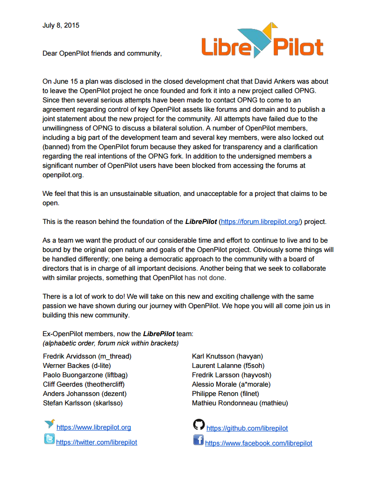

If you know a little bit of OpenPilot history you understand it was more about when, not "if ". After a little less than 4 years of contributions to the OpenPilot project it was time to part.

Just to give a bit of context, I started with OP at the beginning of 2012, working at the early stage of the revolution firmware and hardware development. I mostly took care of the bare metal firmware side, sensors and peripherals interfaces, porting the code to various targets (i.e. STM32 F0 for GPS V9, STM32F411 for nano Nano). I‘ve also participated in hardware development/validation and testing since the initial Revolution prototypes (not the small officially sold, but the previous bigger brother [Revolution Prototype](http://wp.me/p1tDhc-2H) . I worked at flight performances improvement with mini quads for CC3D/Revo (the thing that, together with the acro+ develiped by Eric/CorvusCorax, made CC3D so popular in the 250 class racers) , implemented OneShot, notification smart leds support, a new sensor framework implementation and several other things.

Later I'll have to write some detailed chronological history of the awful situations, the falsification and everything else happened in the last 1 and 1/2 months that brought me, most of the development team and several key members to build a new project (LibrePilot) from the roots of OpenPilot.

One question that i have been asked several time is: wouldn't be better to join to an existing project, like TauLabs?

This was actually one of the possibilities, the fact is that we are already a solid, very well proven team and this may have caused "integration " issues.

But the intentions are to collaborate with other projects, especially TauLabs. Probably one of the best (long term) bets for both projects is to converge to a single codebase that takes the best of both worlds. Unfortunately it is a quite demanding task as in the last couple of years they have diverged a lot, but surely it will worth the effort, both in term of features/quality than in term of critical mass of users and development team.

